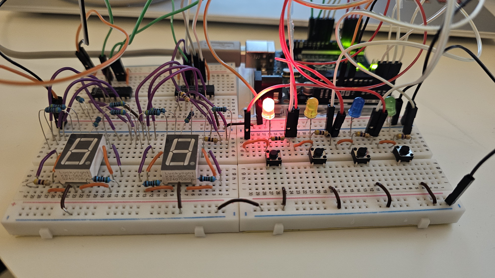

# SpedenSpelit_Ryhma26
School project

Project name: SpedenSpelit

    in the 90's in Finland ther was a gameshow on tv called SpedenSpelit. 
    In this gameshow Nopeustesti -game was introduced to public. 
    Nopeustesti -game is a reaction game that has 4 LED buttons. 
    LED buttons are lit randomly and player must press the right button in order to continue the game. 
    As the game progresses, LEDs light up faster and the game comes more difficult.

Project goals:

    Main goal for the project is to make our own version of the SpedenSpelit reaction game. 
    We are using Arduino UNO microcontroller for the game. 
    All needed components are connected to breadboard in order of achieving working hardware.
    Game also needs functioning software and coding is done by using Arduino IDE. 
    The code consists of four modules: buttons, leds, display and gamelogic. 
    We need to integrate these modules to get a working game.

Hardware:

    For the game we had these components:

        - Arduino UNO microcontroller
        - 4 LEDs
        - 4 pushbuttons
        - 2 7-segment displays (common cathode)
        - 2 shift registers (74HC595)
        - breadboard(s)
        - Hook up wires and jump wires
        - resistors for the leds (minimun 470 ohm)

    LEDs were connected to Arduino UNO analog pins A2-A5.

    Buttons were connected to Arduino UNO digital pins 2-5.

    First shift register's clock pin was connected to Arduino UNO digital pin 8, 
    latch pin to digital pin 9 and 
    input pin to digital pin 10.

    Second shift register's clock pin was connected to digital pin 11, 
    latch pin to digital pin 12 and 
    input pin to digital pin 10 (same as first shift register).

    Both shift register's power pin and SRCLR input pin were connected to Arduino UNO's 5V pin. 
    Output Enable pin and ground pin were connected to ground.

    Shift register's output pins were connected via resistors (minimum 470 ohm) to 7-segment display as followed:
        QA - DP
        QB - A
        QC - B
        QD - C
        QE - D
        QF - E
        QG - F
        QH - G
        QH' - NOT CONNECTED

    7-segment common cathode pin was connected to ground.

Software:
    Coding was done by using Arduino IDE.
    We were given baseline code for the project. 
    This code consisted of four modules; leds, buttons, display and gamelogic. 
    Gamelogic is basically the main .ino file. 
    We ended up also adding module gamechecking.

    Firstly we coded leds, buttons and display modules. 
    After that we concentrated on gamelogic and gamechecking module was made as by-product.

    Modules includes following functions and subroutines:

        Leds.cpp
            -void initializeLeds();
            -void setLed(int ledNumber);
            -void clearAllLeds(void);
            -void setAllLeds(void);
            -void show1(void);
            -void show2(int);
            -void shutLed (int);
            -void blinkLeds();
        Buttons.cpp
            -void initButtonsAndButtonInterrupts(void);
            -ISR(PCINT2_vect);
        Display.cpp
            -void initializeDisplay(void);
            -void writeByte(uint8_t number, bool last);
            -void writeHighAndLowNumber(uint8_t tens,uint8_t ones);
            -void showResult(byte result);
            -void textGameOver();
        Gamelogic (SpedenSpelit.ino)
            -void initializeTimer(void);
            -ISR(TIMER1_COMPA_vect);
            -void initializeGame(void);
            -void checkGame(byte);
            -void startTheGame(void);
            -void gameOver();

Project outcome:

    
    
    The project was a success. 
    We were able to fully replicate the SpedenSpelit Nopeustesti game, 
    integrating all the hardware components on a breadboard and 
    ensuring the software operated as intended. 
    The game responds to player inputs via the buttons, 
    with LEDs lighting up in a random pattern, and the pace increasing as the game progresses.
    Gamechecks are done correctly during the game and the displays show scores.
    After game over, the game returns to the starting state and player can start a new game.

Areas of responsibility:
    Janina Niemelä
        -Display module
    Samu Hintsala
        -Buttons module
    Oskari Moisanen
        -Leds module
    All team members
        -Gamelogic

Sources:

Arduino forum
    https://forum.arduino.cc/
Arduino language reference:
    https://docs.arduino.cc/language-reference/
Datasheets:
    - shift register: https://www.ti.com/lit/ds/symlink/sn74hc595.pdf
    - 7-segment display: https://panda-bg.com/datasheet/1963-092044-Single-LED-Digit-Display-KW1-561CSA-RED.pdf
